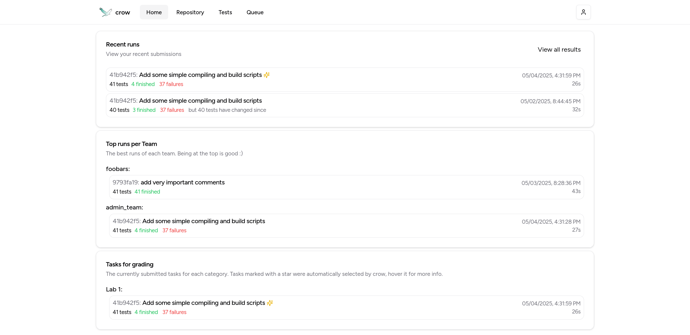
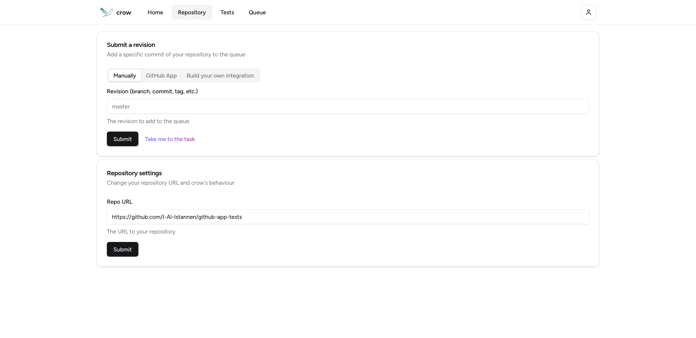
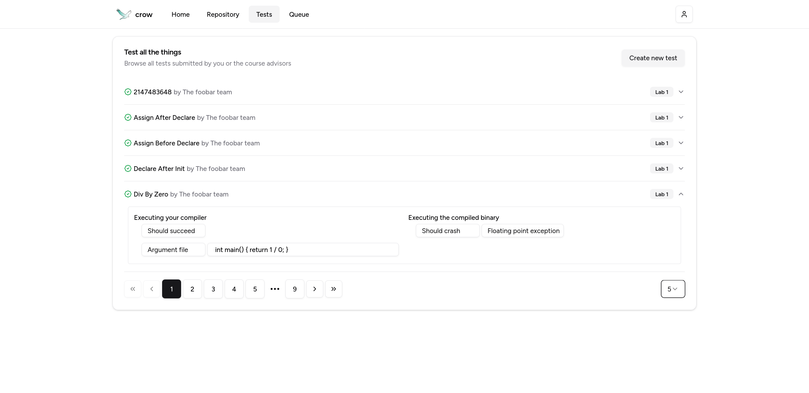
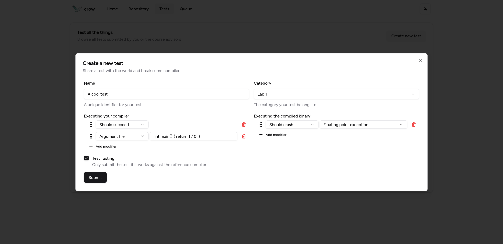
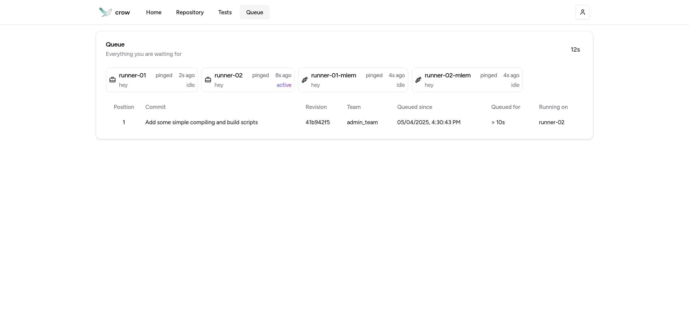
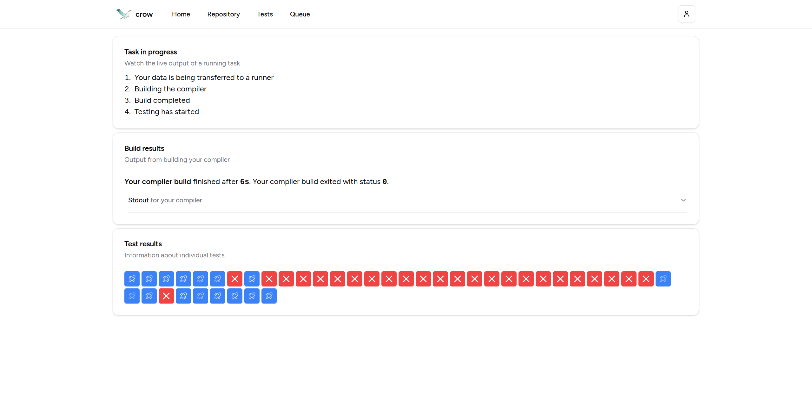
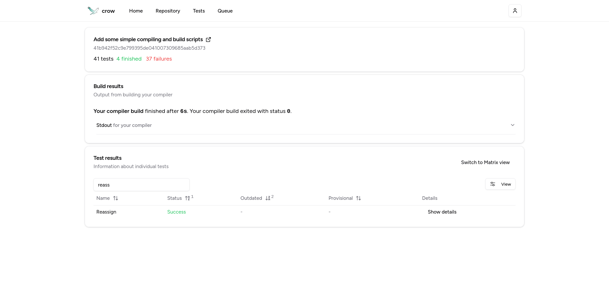

  
  <h1><code>crow</code></h1>

`crow` is an all-in-one distributed testing platform for student submissions,
focused on compilers.
Students and advisors can collaborate on test cases, submit them to `crow`
using the website or CLI tool, and test their compilers against them.

## Features
- `crow` uses OIDC for logins
- `crow` executes tests in parallel inside lightweight, isolated containers
- `crow` offers a flexible test syntax using arguments, exit codes, as well as
  in- and outputs
- `crow` offers a GitHub app, syncing test results with GitHub commit status
- `crow` automatically installs secrets using the GitHub App
- `crow` automatically suggests workflows testing every commit using the GitHub
  App
- `crow` live-streams test results to users
- `crow` offers a generic "queue this commit" and "what is the test status for
  commit" for custom integrations
- `crow` offers a CLI client to mirror tests into a directory, run them or
  upload new ones

## Screenshots

  
  
  
  
  
  
  

## Setup
We provide a Nix flake that builds every individual component, as well as docker images.

**Build** docker images
  - `nix build github:I-Al-Istannen/crow#docker.backend`
  - `nix build github:I-Al-Istannen/crow#docker.frontend`
  - `nix build github:I-Al-Istannen/crow#executor`\*  
    \* <small>The executor uses `runc` for sandboxing and can not run inside docker
    itself.</small>
  - `nix build github:I-Al-Istannen/crow#client`\*  
    \* <small>Running the client is best done locally.</small>

**Build** binaries
  - `nix build github:I-Al-Istannen/crow#backend`
    - Or `cargo build --release --bin backend-web`
  - `nix build github:I-Al-Istannen/crow#frontend`
  - `nix build github:I-Al-Istannen/crow#executor`
    - Or `cargo build --release --bin executor`
  - `nix build github:I-Al-Istannen/crow#frontend`
  - `nix build github:I-Al-Istannen/crow#client`
    - Or `cargo build --release --bin client`

**Execute**
  - `backend config.toml` <small>[sample config](https://github.com/I-Al-Istannen/crow/blob/master/backend-web/config.toml)</small>
  - `executor <name> <token> <backend url>` <small>You need at least one runner.</small>
  - `executor <name> <token> <backend url> --test-taster` <small>You need at least one dedicated "test-taster" if you enable the feature in the config.</small>
  - `client --help` <small>The client guides you through authentication and functionality in the help output.</small>

## Development

### Backend
- If you touch the database, you want to remove the `SQLX_OFFLINE=true` from
  the `backend-web/.env` file
- If you need to update the database (or create one for sqlx to use in online
  mode), use `cargo sqlx database drop && cargo sqlx database setup`
- If you made changes to any query, you need to regenerate the sqlx data using
  `cargo sqlx prepare`. This requires a database from e.g. the step before.
- The backend and all other rust components can be build by running `cargo
  build [--release]` and run using `cargo run [--release] -- <args>`
- You can format all code using `cargo fmt` in the root directory (or a
  subproject)
- You can lint all code using `cargo clippy` in the root directory (or a
  subproject)

### Frontend
- You need to install dependencies first using `pnpm install`
- You can start a dev server using `pnpm dev`
- You can lint all code using `pnpm lint && pnpm build`
- You can format all code using `pnpm format`
- You can build the frontend to the `frontend/dist` folder using `pnpm build`
